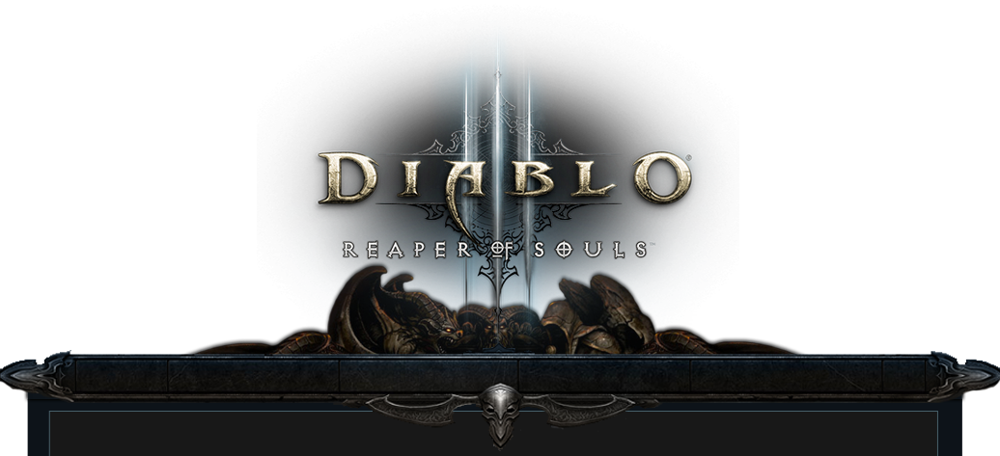
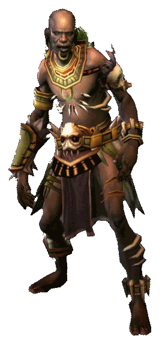

<!-- --- -->
<!-- title       : Diablo Three -->
<!-- subtitle    : INFO 550 -->
<!-- author      : Sara Khan -->
<!-- framework   : html5slides -->
<!-- highlighter : highlight.js -->
<!-- hitheme     : tomorrow -->
<!-- ext_widgets : {rCharts: ["libraries/highcharts", "libraries/nvd3", "libraries/polycharts"]}      # {mathjax, quiz, bootstrap} -->
<!-- mode        : selfcontained # {standalone, draft} -->
<!-- knit        : slidify::knit2slides -->

<!-- --- -->

```{r setup, include=FALSE}
knitr::opts_chunk$set(cache=TRUE)
require(knitr)
library(jsonlite)
library(XML)
library(dplyr)
library(plyr)
library(RCurl)
library(rCharts)
library(metricsgraphics)
library(RColorBrewer)
library(tidyr)
library(splitstackshape)
setwd("C:/Users/Sars/Documents/Spring 2016/Software Engineering/Project/BattleAPI/BattleNet")
```


<center><h3>INFO 550 Final Project </center></h3>
<center><h4>Sara Khan</center></h4>

---

## What is Diablo 3?
<br>
<br>
* It is a competitive Action RPG 
* Made in 2012
*
<br>
* New "Season" starts every 3 months
  + Race to the top of the leaderboard

---

You can pick 1 of 6 classes:
<br>
* barbarian
* witch doctor 
* monk 
* demon hunter 
* wizard
* crusader  

---

## Barbarian


---

## Witch Doctor



---

## Monk


---

## Demon Hunter


---

## Wizard


---
## Crusader


---
    

## Theorycraft 
<br>
<br>
* You have unique skills and items that let you kill stuff faster
* How can you minimize and maximize your hero stats to win?


---

## In August 2015, the Diablo 3 API became available...


---

## So I decided to ask the Diablo 3 Community what questions they'd like answered from the API.

---

# My question...


---
# The answers...


---
# The answers...


---

# The answers...


---

# I decided on two research questions..

---
<br>
## 1. Does the rank of a person correspond to any player statistic?

---

### What is a player statistic?


---


Again, the queston: 
<br>
<br>
Does the rank of a person correspond to any player statistic?
<hr>

To answer that, I created an interactive polychart.js graphic with "dat.gui" (angularJS) controls built in.


---

<section class="slide"><div>
<iframe src ='pics/graph1.html', width = "860px", height = "1000px"></iframe>
</div></section>

---

My second question was to answer what "clothing sets" are the most popular in the top leaderboard.

---

Clothing gives certain attributes to increase player stats.


---

To answer this, I looked at the most frequent sets per class. I wanted to look at the top 1000 and top 100 to see differences.

---

I'll use the "nv.d3" javascript library to plot each class and the most frequent sets used.

---
<section class="slide"><div>
Most frequent sets in the top 1000 of the Diablo 3 Season 6 leaderboard.


<iframe src ='pics/top1000.html', width = "860px", height = "1000px"></iframe>
</div></section>

---
<section class="slide"><div>
Most frequent sets in the top 100 of the Diablo 3 Season 6 leaderboard.


<iframe src ='pics/top100.html', width = "860px", height = "1000px"></iframe>
</div></section>

---

Thanks!
<br>
<br>

<br>
<br>
Questions?
<br>


