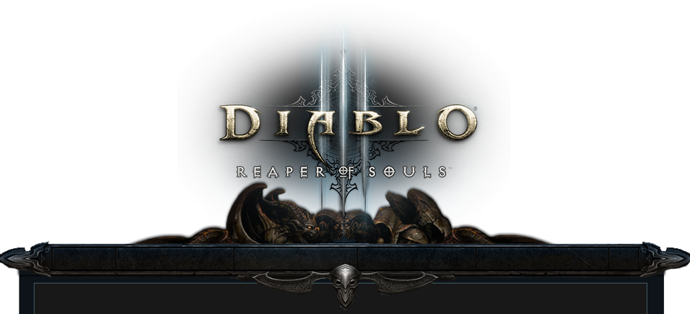
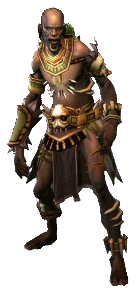
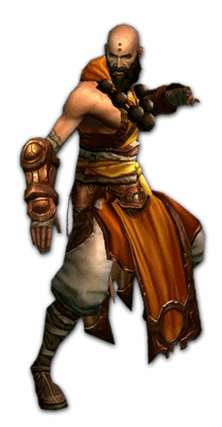
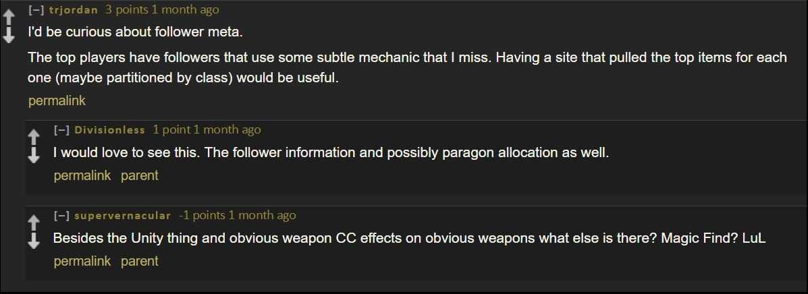
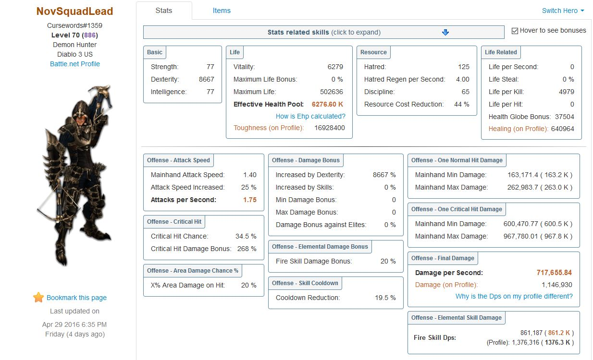
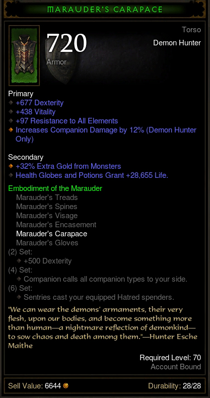

<!-- --- -->
<!-- title       : Diablo Three -->
<!-- subtitle    : INFO 550 -->
<!-- author      : Sara Khan -->
<!-- framework   : html5slides -->
<!-- highlighter : highlight.js -->
<!-- hitheme     : tomorrow -->
<!-- ext_widgets : {rCharts: ["libraries/highcharts", "libraries/nvd3", "libraries/polycharts"]}      # {mathjax, quiz, bootstrap} -->
<!-- mode        : selfcontained # {standalone, draft} -->
<!-- knit        : slidify::knit2slides -->

<!-- --- -->




<center><h3>INFO 550 Final Project </center></h3>
<center><h4>Sara Khan</center></h4>

---

## What is Diablo 3?
<br>
<br>
* It is a competitive Action RPG 
* Made in 2012
*
<br>
* New "Season" starts every 3 months
  + Race to the top of the leaderboard

---

You can pick 1 of 6 classes:
<br>
* barbarian
* witch doctor 
* monk 
* demon hunter 
* wizard
* crusader  

---

## Barbarian


---

## Witch Doctor



---

## Monk



---

## Demon Hunter


---

## Wizard


---
## Crusader


---
    

## Theorycraft 
<br>
<br>
* You have unique skills and items that let you kill stuff faster
* How can you minimize and maximize your hero stats to win?


---

## In August 2015, the Diablo 3 API became available...


---

## So I decided to ask the Diablo 3 Community what questions they'd like answered from the API.

<!-- --- -->

<!-- # My question... -->

<!--  -->


---

# The answers...


---

# The answers...


---

# The answers...


---

# I decided on two research questions..

---
<br>
## 1. Does the rank of a person correspond to any player statistic?

<!-- --- -->

<!-- ### What is a player statistic? -->

<!--  -->

---


<!-- Again, the queston:  -->
<!-- <br> -->
<!-- <br> -->
<!-- Does the rank of a person correspond to any player statistic? -->
<!-- <hr> -->

To answer that, I created an interactive polychart.js graphic with "dat.gui" (angularJS) controls built in.


---

<section class="slide"><div>
<iframe src ='pics/graph1.html', width = "860px", height = "1000px"></iframe>
</div></section>

---

My second question was to answer what "clothing sets" are the most popular in the top leaderboard.

---

Clothing gives certain attributes to increase player stats.



---

To answer this, I looked at the most frequent sets per class. I wanted to look at the top 1000 and top 100 to see differences.

---

I'll use the "nv.d3" javascript library to plot each class and the most frequent sets used.

---
<section class="slide"><div>
Most frequent sets in the top 1000 of the Diablo 3 Season 6 leaderboard.


<iframe src ='pics/top1000.html', width = "860px", height = "1000px"></iframe>
</div></section>

---
<section class="slide"><div>
Most frequent sets in the top 100 of the Diablo 3 Season 6 leaderboard.


<iframe src ='pics/top100.html', width = "860px", height = "1000px"></iframe>
</div></section>

---

### Methods

---


* Get the names of top 1000 players from the most current leaderboard from the Diablo 3 API.
<br>
* Get data of the top 1000 players from a different data source on the same API.
<br>
* Cleaning.
<br>
* Answer the research questions and create graphs.
* Host the data for people to see.


---

### First step <br>
 Get the names of top 1000 players from the most current leaderboard from the Diablo 3 API.


--- 


```r
top1000<-fromJSON(paste0("https://us.api.battle.net/data/d3/season/6/leaderboard/achievement-points?access_token=",SARAKEY))
```


```
##   Rank   HeroBattleTag   HeroId    HeroClass
## 1    1 Knightmare#1642 50291904 demon hunter
## 2    2 Cursewords#1359 75503053 demon hunter
## 3    3        wby#1325 75508223 demon hunter
## 4    4 Blacksheep#1512 75438396 demon hunter
## 5    5     Beldox#1259 75506076       wizard
## 6    6   Tarzimal#1145 75510116 demon hunter
```


---


```
##   Rank   HeroBattleTag   HeroId    HeroClass
## 1    1 Knightmare#1642 50291904 demon hunter
## 2    2 Cursewords#1359 75503053 demon hunter
## 3    3        wby#1325 75508223 demon hunter
## 4    4 Blacksheep#1512 75438396 demon hunter
## 5    5     Beldox#1259 75506076       wizard
## 6    6   Tarzimal#1145 75510116 demon hunter
```

---

### Second step

<br>
Get data of the top 1000 players from a different data source on the same API.

---

I had to create unique urls for each user and their "hero" number...


```r
heroItemURL <- lapply(1:1000, function(i) {
  
  paste0("https://us.api.battle.net/d3/profile/",
         results$HeroBattleTag[i],
         "/hero/",
         results$HeroId[i],
         "?locale=en_US&apikey=",
         key)
})
```

---

And then use that URL to create 1000 queries to the Battle.Net API


```r
heroItems<-lapply(1:1000, function(i) {
  fromJSON(heroItemURL[[i]])
})
```


---

## I ran into a problem, however.

---

### There were unicode characters in some of the URLs (around 40-50 users)

"https://us.api.battle.net/d3/profile/流星追月#3113/hero/69485497?locale=en_US&apikey=SARAKEY"

---

Those URLs did not render in R, but they somehow fixed themselves and were able to correctly get back the data.

---

## Third step
<br>
Cleaning


---

### The data that was returned were in nested lists within lists...

---

### So I had to be creative in grabbing the data out of it. <br><br>

Here's an example:


```r
setItems<- lapply(1:1000, function(i) {
  (heroItems[[i]]["items"][[1]][1][[1]]["setItemsEquipped"][[1]])
})
```


---

### More cleaning

Here's an example of a function I wrote called "setClean". <br>

This loops through the 6 classes to pull out the most frequent sets for each class.


```r
setClean<-function(x){
as.data.frame(xtabs(~ setName + class , x))[!as.data.frame(xtabs(~ setName + class , x))$Freq==0, ]
}

classSets1000<-setClean(heroSetDataFinal) #all 1000 top players
classSets100<-setClean(filter(heroSetDataFinal, (rank%in%(1:100)))) #only the top 100 ranked players
                
head(classSets1000)       
```

---

## Fourth step
<br>
Creating graphs to answer my questions

---

I used the rCharts package to create the interactive visualizations


```r
sets1000Plot <- nPlot(
  Freq ~ class, 
  group = "setName",
  data = classSets1000,
  type= "multiBarChart"
)
```


---


## Fifth step
<br>
Publishing my results


---

## To create these slides, I used *slidify*.

---

## I had a problem embedding the visualizations inside my slides. This took a while to figure out..

---

To solve this, I embedded the graphs with HTML iFrames.

---

## I also wanted to publish this on GitHub pages for other users to see.

* I used Jekyll
* GitHub Pages
* Slidify published on GitHub pages

---
## Jekyll

Jekyll is a static site generator that integrates with github. You can create and publish jekyll blogs to your github from RStudio using Yihui's Knitr Jekyll repo.

https://github.com/yihui/knitr-jekyll

---


---

## Next steps

---

Plot my results onto a website for people to view on github.

---

Thanks!
<br>
<br>

<br>
<br>
Questions?
<br>

  

